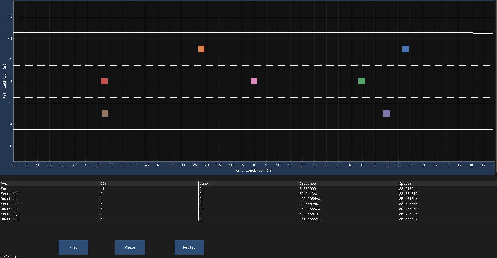
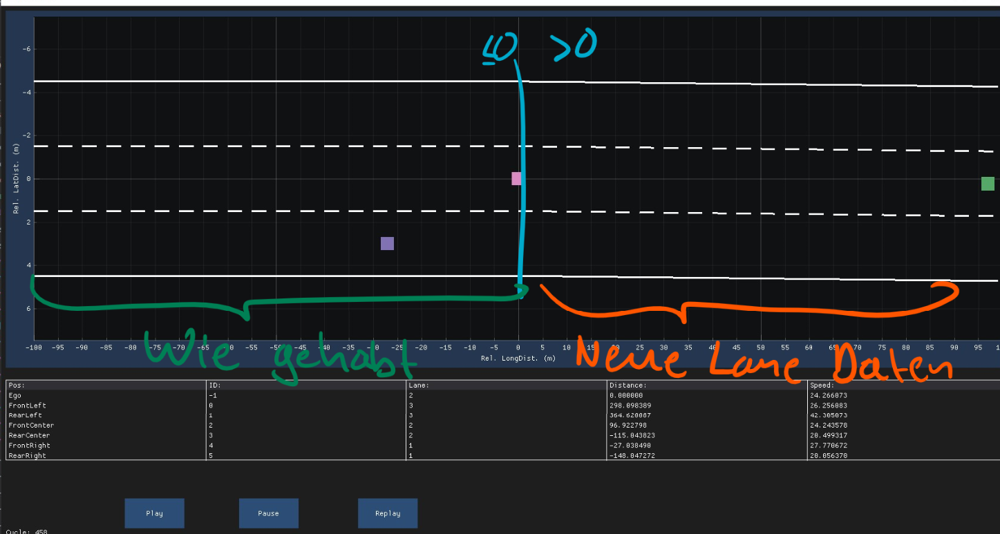

# Dear ImGUI Template to Start

## Example



## Intro

I have added the information about the lanes.  
In a self-driving car, the camera will deliver the lane information.  
In this exercise the lane border shape is given by a 3rd-degree polynomial:

$p(x) = a^3 * x + b^2 * x + c * x + d$

If you plug in an x value (longitudinal distance in meter) you will get the lane position.  
Since our use case has 3 lanes in total and each lane has 2 lane borders (left and right border of each lane), there will be 6 polynomials in total.

Left Lane:

- Left Border (called LeftLeftBorder)
- Right Border (called LeftRightBorder)

Center Lane:

- Left Border (called CenterLeftBorder)
- Right Border (called CenterRightBorder)

Right Lane:

- Left Border (called RightLeftBorder)
- Right Border (called RightRightBorder)

Note:

LeftRightBorder and CenterLeftBorder are the same polynomials.  
CenterRightBorder and RightLeftBorder are the same polynomials.  

## Exercise

Use the new Lane structs from the AdTypes header to plot the lanes.  

```cpp
struct Polynomial3rdDegreeType
{
    float a;
    float b;
    float c;
    float d;

    /**
     * @brief To compute p(x) = a^3 * x + b^2 * x + c * x + d
     */
    float operator()(const float x) const
    {
        const auto x_3 = std::powf(a, 3.0F) * x;
        const auto x_2 = std::powf(b, 2.0F) * x;
        const auto x_1 = std::powf(c, 1.0F) * x;
        const auto x_0 = d;
        return x_3 + x_2 + x_1 + x_0;
    }
};

struct LaneType
{
    Polynomial3rdDegreeType left_polynomial;
    Polynomial3rdDegreeType right_polynomial;
};

struct LanesType
{
    LaneType left_lane;
    LaneType center_lane;
    LaneType right_lane;
};
```

For plotting the lanes you have to use the polynomials.  
For now, we will only use the polynomials to plot the lane in front of us (x > 0).  
The lane behind us will be just a straight line, as it was before.  
This will be extended in the next exercise.  
Furthermore, we will plot the vehicle in the middle of the lanes.  
Hence, in front of us, you have to compute the center point of the lane.  


