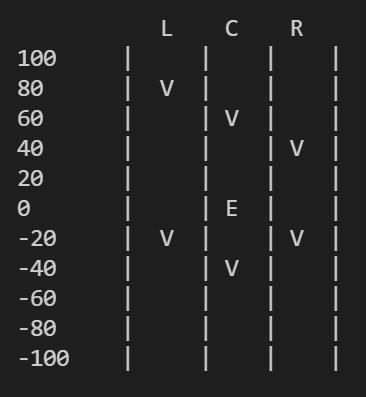

# Exercise

Implement the following functions:

```cpp
void print_scene(const VehicleType &ego_vehicle, const NeighborVehiclesType &vehicles);

void compute_future_state(const VehicleType &ego_vehicle,
                          NeighborVehiclesType &vehicles,
                          const float seconds);
```

- print_scene: Implement a function that output the following concerning the ego and all other vehicles



- compute_future_state
  - Compute the position of all vehicles in **n** seconds
  - Assuming all vehicle have constant velocity (no change in the speed)

Hint: The future distance of a vehicle is dependent on the ego vehicle, since the ego vehicle is always at the distance (x) = 0, hence the ego vehicle is the origin of the coordinate system.

## Main Function

```cpp
#include <cstring>
#include <iostream>
#include <numeric>

#include "AdFunctions.hpp"
#include "AdTypes.hpp"

int main()
{
    VehicleType ego_vehicle{};
    NeighborVehiclesType vehicles{};

    init_ego_vehicle(ego_vehicle);
    init_vehicles(vehicles);

    print_vehicle(ego_vehicle);
    print_neighbor_vehicles(vehicles);

    print_scene(ego_vehicle, vehicles);

    std::cout << "Compute forward (1sec)?: ";
    char Input;
    std::cin >> Input;

    while (Input == 'y')
    {
        compute_future_state(ego_vehicle, vehicles, 1);
        print_scene(ego_vehicle, vehicles);

        std::cout << "Compute forward (1sec)?: ";
        std::cin >> Input;
    }

    return 0;
}
```
